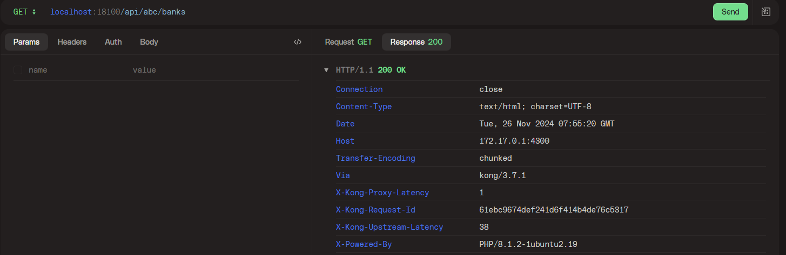

# Kong custom plugins

## Introduction
In this repo, there are 2 plugins:
- js-hello: Takes name from X-Name request header and return it as greeting in X-Greetings response header
- js-path: Strip path prefix and forward it to destination service

## Developing
1. Clone this repository
2. Run `npm install`
3. Go to `plugins` folder, then run `npm install` once more.
4. You are good to go.

## Deploying
Since this is custom plugin, you need to install prerequisites such as nodejs and kong-pdk.
1. Go to your kong server
    > If you were using docker, go to the inside container using `docker exec -itu 0 your-container-name bash`
2. Install nodejs 18
3. Install kong-pdk by running `npm i -g kong-pdk`
4. Upload the plugins folder into the kong server inside folder `/usr/local/kong/js-plugins`
    > If you were using docker, copy the content by `docker cp plugins/. your-container-name:/usr/local/kong/js-plugins`
5. Copy or replace the content of the `/etc/kong/kong.conf` with the one provided in `kong-central.conf` in this repo. Make sure you make some adjustment according to your need.
6. Restart kong service
    > In docker, just use `docker restart your-container-name`

## JS-Path
This plugin removes path prefix that was sent by client and forward the cut version to the destination service. For example: A request sent by Postman using path `/api/abc/banks` will be received by the upstream as `/token` if the prefix is set to `/api/abc`.

### Demo **without** plugin enabled

HTTP Client:

Upstream Server:

### Demo **with** plugin enabled
Plugin config:

HTTP Client:

Upstream Server:

